# TIA Openness Manager V3

**Streamline Your Siemens TIA Portal Workflow**

---

## What is TIA Openness Manager?

TIA Openness Manager is a productivity tool for Siemens TIA Portal developers that transforms how you export, import, compare, and protect PLC program blocks. Hour-long manual tasks become single-click operations — and you get AI, OPC UA, encrypted vaults, and version control on top.

**V3 Highlights**

- Process-separated design — a UI crash never takes down your TIA Portal connection
- Modern dark-theme UI built from the ground up
- Built-in **OPC UA Client** for live PLC data
- **AI Chat** with context folders, git integration, skills, and custom agents
- **Password Vault** for encrypted know-how protection credentials
- **Project Library Management** with full MCP integration
- **Unit Testing** (Beta, requires PLCSIM Advanced V3.0+)
- TIA Portal V21 support

---

## Features

### Import & Export

- **Bulk Operations** — export or import hundreds of blocks at once
- **XML, SCL, and S7DCL** — all standard TIA Portal formats supported
- **S7DCL (V20+)** — text-based format for clean version control
- **Folder Structure Preserved** — your TIA hierarchy stays intact
- **Auto-Compile & Save** — automatic compilation after import

### Find Unused Blocks

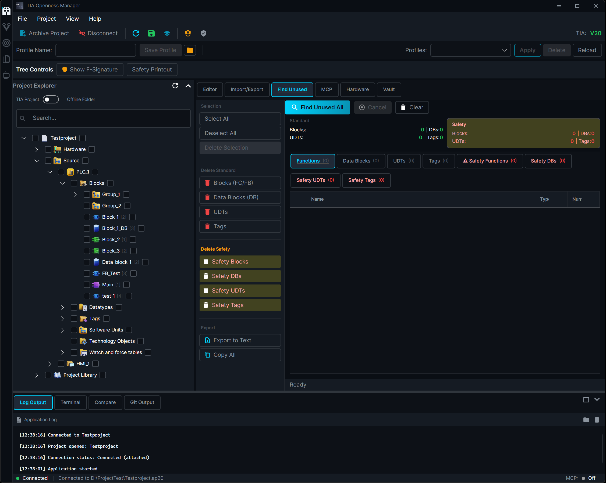

- **Dead Code Detection** — blocks not called by any OB
- **Call-Graph Analysis** — based on actual calls, not just references
- **Safety Block Support** — F_FB, F_FC, F_DB, F_OB all included
- **Export or Delete** — CSV report or direct cleanup in TIA Portal

### Difference Comparison

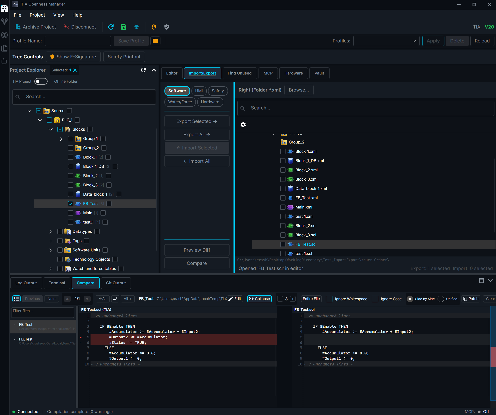

- **Fingerprint-Based** — fast diff without full re-export
- Detects modified, new, and deleted blocks
- **Line-by-Line Diff** viewer
- **Selective Re-Export** — export only what changed

### Code Editor

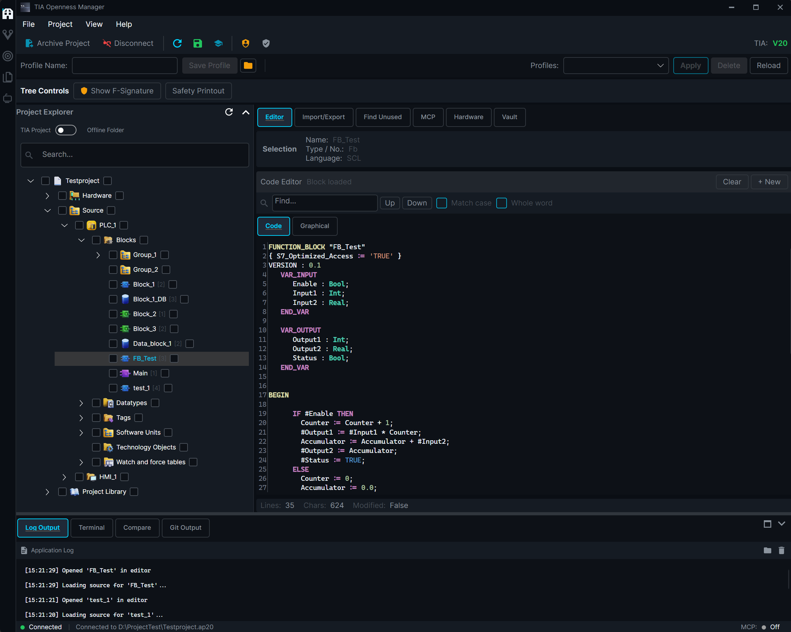

Integrated SCL editor with syntax highlighting, search & replace, and inline diff view. Edit exported blocks without leaving the app.

### Protection System

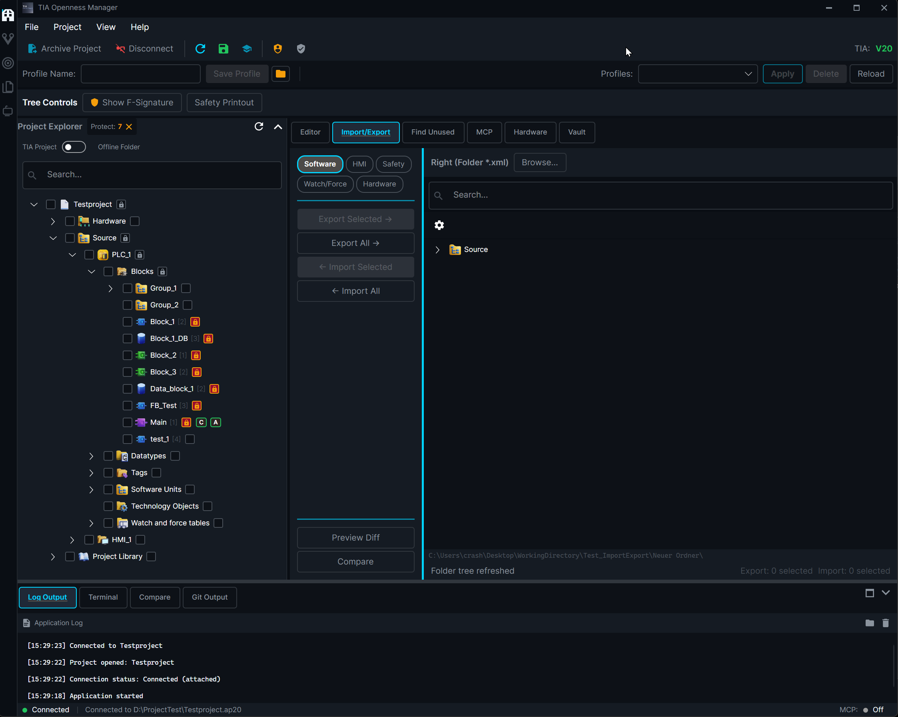

- **Block Protection** prevents accidental overwrites of critical blocks
- **Protection Profiles** — save and load configurations
- **Visual Indicators** — protected items clearly marked in the tree

### Password Vault

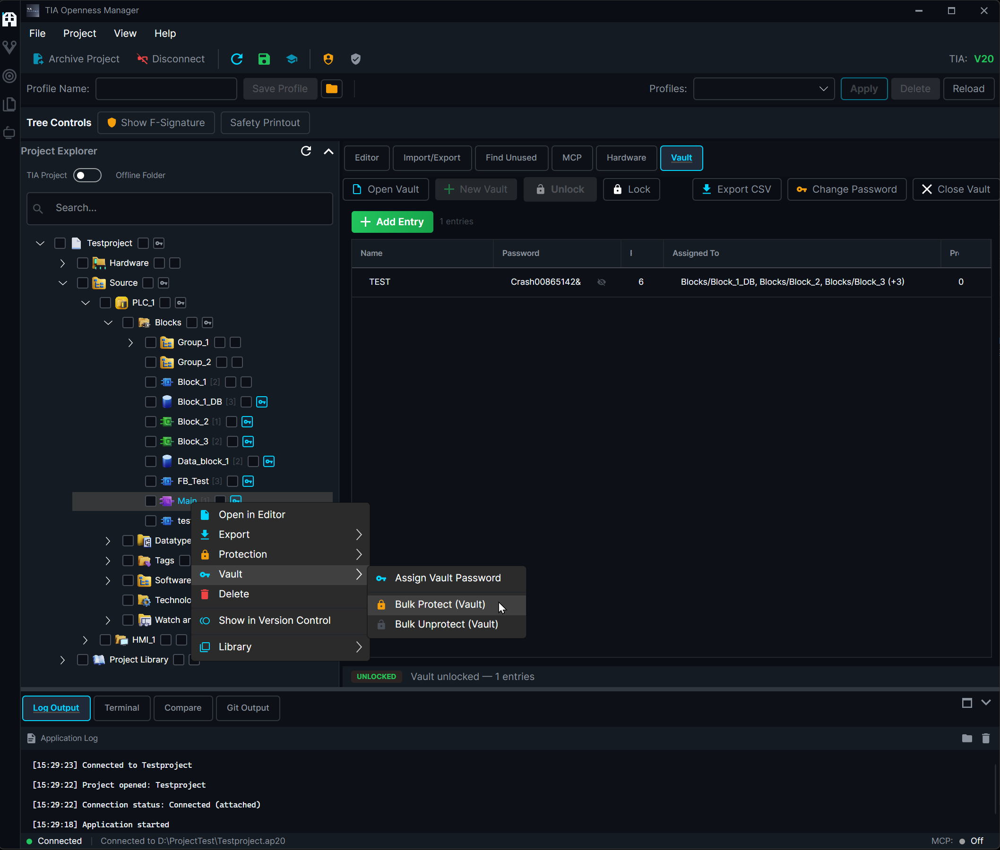
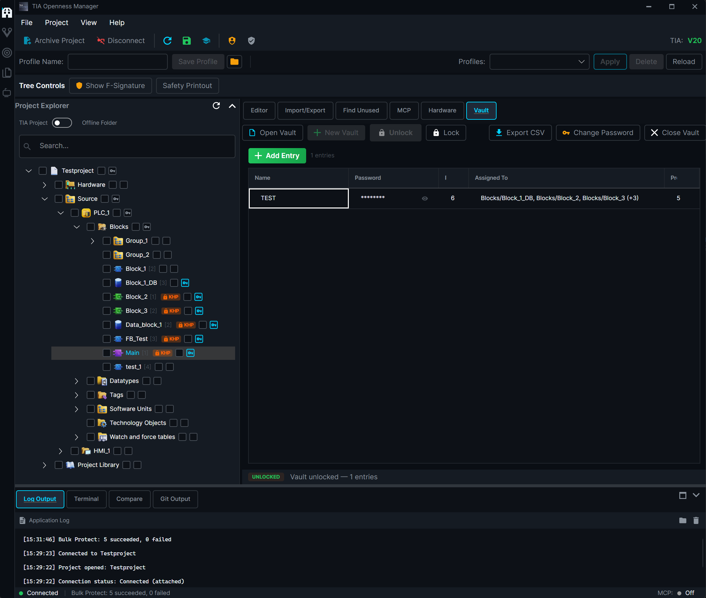

- **AES-256-GCM encrypted vault** for TIA Portal know-how protection passwords
- **Single Master Password** protects all vault entries
- **Bulk Protect / Unprotect** — apply or remove know-how protection on all assigned blocks at once
- **Crash Recovery** — blocks left unprotected during a crash are automatically re-protected on next launch

### Unit Testing (Beta)

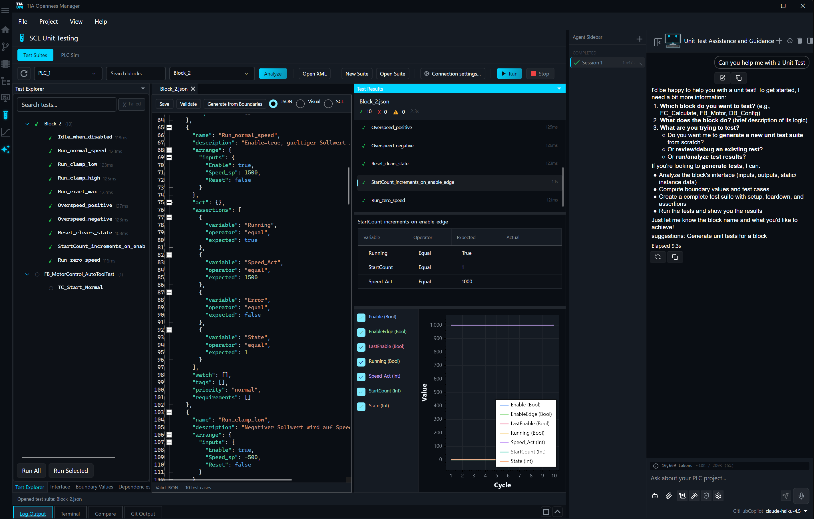

Define test cases for SCL blocks with expected inputs and outputs. Run tests against a live PLCSIM Advanced instance and see pass/fail at a glance. Catch regressions before they reach your PLC.

> Requires **PLCSIM Advanced V3.0+** (separate Siemens license).

### Project Library Management

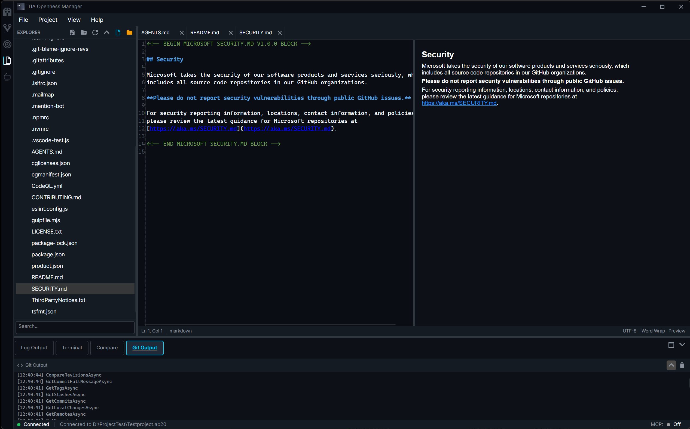

- **Master Copy Creation** — copy blocks into the Project Library for reuse
- **Export Library Types** — as versioned XML files
- **Folder Organization** — create, rename, delete library items
- **Automatic Cleanup** — remove unused types and versions

### HMI Support

- Export / import HMI screens and templates
- Full HMI tag table support
- VB Scripts and script functions
- Text and graphic lists (multi-language)
- **WinCC Unified** support

### Hardware Management

- Device overview — PLCs, HMIs, Drives, Switches
- Network info — PROFINET names, IP addresses, firmware versions
- Export device, module, and network configuration as XML
- CSV export for documentation

### OPC UA Client

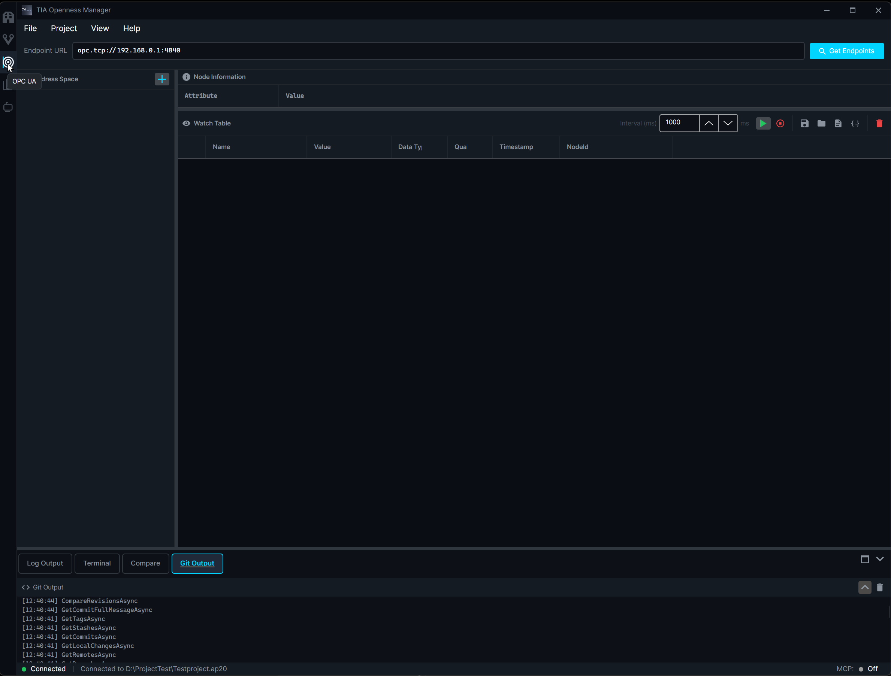

- **Direct Connection** to any OPC UA server by endpoint URL
- **Auto-Discovery** — detects PLC OPC UA endpoints from the connected TIA Portal project
- **Address Space Browser** — full tree view
- **Watch Table** — read, write, and live-subscribe to variables
- **Save / Load Configurations** and export watch data as CSV or JSON

### AI Chat & MCP Integration

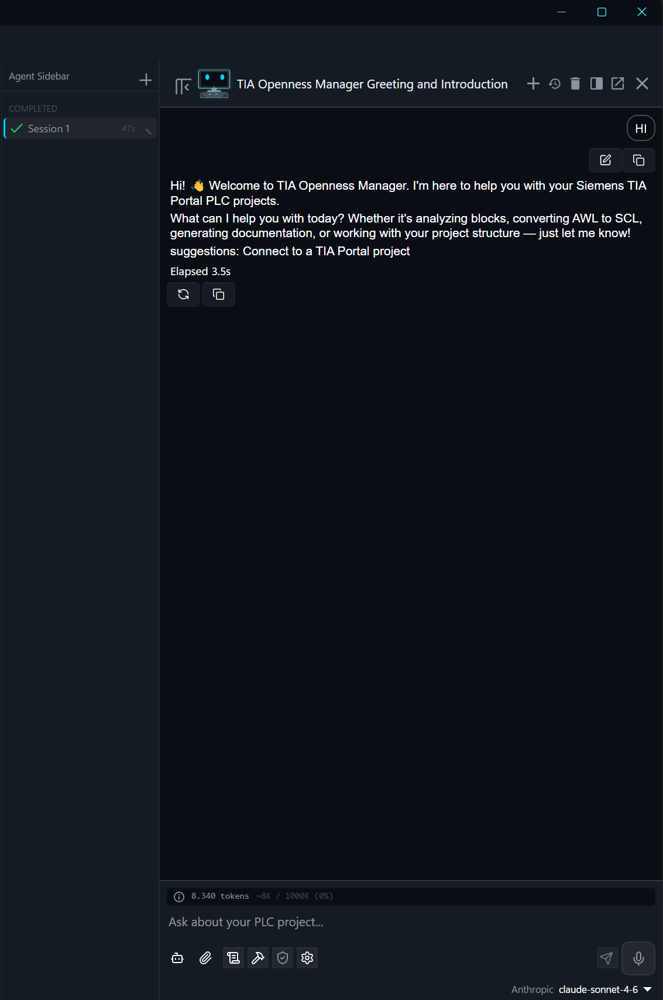

- **Built-in AI Chat** with context folders, file attachments, and session history
- **MCP Server** — connect any MCP-compatible AI assistant to your TIA Portal project
- **Code Generation** — AI writes SCL blocks, DBs, UDTs, and tag tables, with direct import into TIA Portal
- **Git Integration** — the AI is aware of your repo (status, commit, push, pull, diff)
- **Skills & Agents** — custom prompt commands and AI personas
- **Embedded Terminal** with MCP tooling
- **Library Tools** — 7 dedicated AI tools for the Project Library
- **OPC UA Tools** — 8 dedicated AI tools for live PLC data

### Version Control

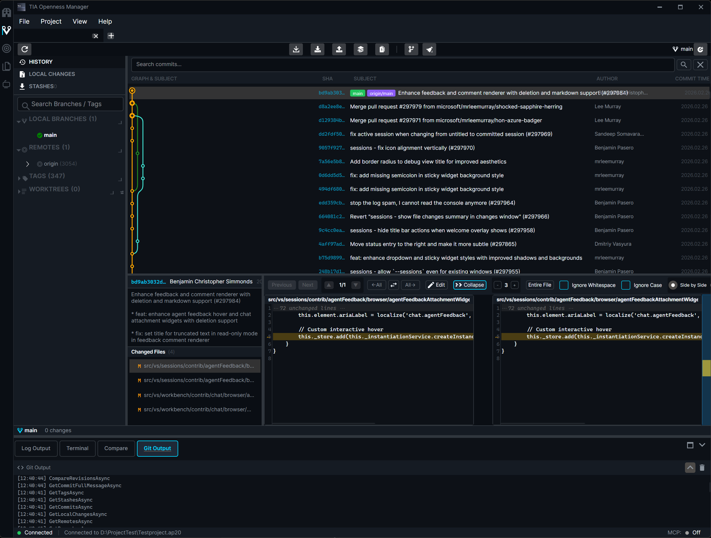

Inline git integration — browse project history, commit, push, pull, and diff without leaving the app.

---

## Supported TIA Portal Versions

| Version | Status |
|---------|--------|
| V15 | Supported |
| V16 | Supported |
| V17 | Supported |
| V18 | Fully Supported |
| V19 | Fully Supported |
| V20 | Fully Supported |
| V21 | Fully Supported |

---

## System Requirements

- **OS:** Windows 10 / 11 (64-bit)
- **Installer:** Self-contained — all dependencies bundled, no separate runtime to install
- **TIA Portal:** V15, V16, V17, V18, V19, V20, or V21 installed
- **Permissions:** TIA Portal Openness API access configured
- **Optional:** PLCSIM Advanced V3.0+ for SCL Unit Testing

---

## Installation

1. Download the latest installer from [Releases](https://github.com/StaniB88/TIAOpennessManager/releases)
2. Run the installer and follow the setup wizard
3. Launch TIA Openness Manager from the Start Menu
4. Connect to your TIA Portal project (Open or Attach)

**Free Trial:** New users get a 30-day trial with all features unlocked.

---

## Quick Start

1. **Open or Attach** a TIA Portal project
2. **Browse** your PLC blocks in the project tree
3. **Select** the blocks you want to work on
4. **Export** as XML, SCL, or S7DCL — or **Import** back with a single click

See the [User Guide](User_Guide/) for detailed documentation.

---

## Languages

English · Deutsch · Français · Italiano

---

## Documentation

- [User Manual (EN)](User_Guide/UserManual_EN.md) · [User Manual (DE)](User_Guide/UserManual_DE.md)
- [Quick Start (EN)](User_Guide/QuickStart_EN.md) · [Quick Start (DE)](User_Guide/QuickStart_DE.md)
- [Feature Overview](User_Guide/Features_EN.md)
- [Changelog](CHANGELOG.md)

---

## Auto-Update

TIA Openness Manager checks for updates on startup and notifies you when a new version is available. Updates can be disabled in Settings.

---

## Support

- **Website:** [tiaopenessmanager.ch](https://tiaopenessmanager.ch/)
- **Email:** support@tiaopenessmanager.ch
- **Issues:** [GitHub Issues](https://github.com/StaniB88/TIAOpennessManager/issues)

---

## Disclaimer

**The software is provided "as is" without warranty of any kind.**

The provider assumes no liability for:

- Damages caused by faulty LLM outputs or AI-generated code
- Data loss, production downtime, or system failures
- Engineering errors or faulty code generation
- Damages caused by improper use or configuration

**The user bears full responsibility for reviewing and validating all generated content before use in production systems.**

This software uses the official Siemens TIA Portal Openness API. Siemens and TIA Portal are registered trademarks of Siemens AG.

See [EULA](https://www.tiaopenessmanager.ch/eula) and [Terms](https://www.tiaopenessmanager.ch/agb) for full legal details.

---

**© 2026 AnyAutomation. All rights reserved.**

**Made with passion for the automation community**
